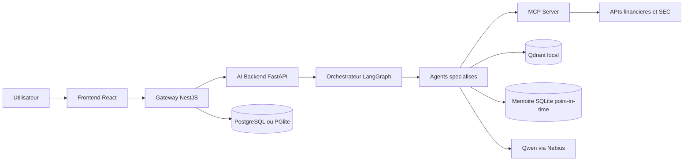
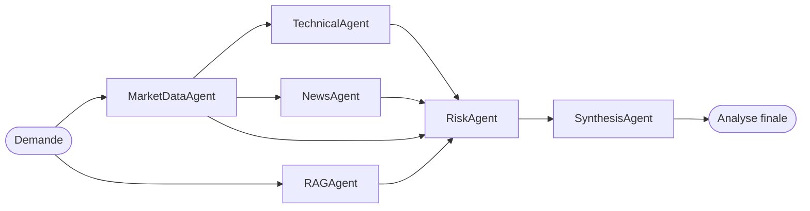

# Stock AI Assistant

Plateforme d'analyse boursiere multi-agents qui combine donnees de marche,
indicateurs techniques, fondamentaux, actualites, documents SEC et analyse de
portefeuille dans une interface de type salle des marches.

[](https://react.dev/)
[](https://nestjs.com/)
[](https://fastapi.tiangolo.com/)
[](https://langchain-ai.github.io/langgraph/)
[](https://qdrant.tech/)
[](https://www.typescriptlang.org/)

> **Avertissement**
> Ce projet est un outil d'analyse, de recherche et de demonstration. Les
> scores, syntheses et recommandations simulees ne constituent pas un conseil
> en investissement ni une garantie de performance future.

## Sommaire

- [Vue d'ensemble](#vue-densemble)
- [Fonctionnalites](#fonctionnalites)
- [Architecture](#architecture)
- [Agents IA](#agents-ia)
- [Methodologie financiere](#methodologie-financiere)
- [Technologies](#technologies)
- [Demarrage rapide](#demarrage-rapide)
- [Configuration](#configuration)
- [Execution locale sans Docker](#execution-locale-sans-docker)
- [API et documentation](#api-et-documentation)
- [Tests et qualite](#tests-et-qualite)
- [Donnees, securite et limites](#donnees-securite-et-limites)

## Vue d'ensemble

Stock AI Assistant automatise une analyse financiere qui serait normalement
repartie entre plusieurs outils. Le systeme collecte des donnees reelles,
execute des agents specialises, mesure la qualite des informations disponibles
et produit une synthese explicable.

Le projet repose sur trois principes :

1. **Separation des responsabilites** : chaque agent traite une dimension
   precise de l'analyse.
2. **Calculs deterministes** : les prix, indicateurs, scores et allocations ne
   sont jamais inventes par le modele de langage.
3. **IA explicative** : Qwen reformule et vulgarise les resultats sans pouvoir
   modifier les valeurs calculees par le moteur financier.

La plateforme comprend l'analyse d'une action, l'analyse d'un portefeuille, la
generation de portefeuilles recommandes, un RAG financier, la gestion des
utilisateurs et un assistant pedagogique.

## Fonctionnalites

### Analyse d'une action

- Recherche et selection de titres americains.
- Prix courant, variation, historique et profil de societe.
- Etats financiers et ratios fondamentaux.
- RSI, SMA, EMA, MACD, ATR, bandes de Bollinger et volatilite.
- Detection de tendance, support et resistance.
- Actualites recentes, deduplication et sentiment.
- Recherche dans les rapports SEC 10-K et 10-Q avec citations.
- Score de risque sur 100 et score de confiance des donnees distinct.
- Synthese finale multi-agents avec trace d'execution.

### Portefeuille

- Saisie de positions, prix moyens et liquidites.
- Valorisation, P&L latent et variation journaliere.
- Allocation par titre et par secteur.
- Concentration, diversification et correlations.
- Performance cumulee et annualisee.
- Volatilite, drawdown maximal, beta, Sharpe, Treynor et alpha de Jensen.
- Comparaison avec un benchmark configurable, par defaut `SPY`.
- Analyse technique et fondamentale de chaque position.
- Synthese globale et plan de reequilibrage simule.

### Recommandation de portefeuille

- Composition selon le budget, le profil de risque, l'objectif et l'horizon.
- Screening fondamental, technique et qualitatif.
- Contraintes de diversification par titre et secteur.
- Validation des finalistes par le workflow multi-agents complet.
- Remplacement automatique des positions qui ne passent pas les controles.
- Journal d'audit expliquant chaque acceptation ou rejet.
- Argumentaire genere par un SLM sans modification des poids calcules.

### Experience utilisateur

- Inscription, connexion, deconnexion et profil investisseur.
- Sessions opaques dans un cookie `HttpOnly`.
- Historique des analyses isole par utilisateur.
- Restauration des resultats encore frais lors de la navigation.
- Chatbot pedagogique pour expliquer RSI, beta, Sharpe, PER, spot, forward, etc.
- Signal Reddit independant, sans influence sur le pipeline d'analyse.

## Architecture

Le depot suit une architecture multi-services :

```text
stock-ai-assistant/
|-- frontend/          React 19 + Vite
|-- gateway/           NestJS, authentification et API publique
|-- ai-backend/        FastAPI, agents, LangGraph, memoires et Qdrant
|-- mcp-server/        Outils MCP et connecteurs de donnees financieres
|-- docker-compose.yml Orchestration locale des services
`-- README.md
```

### Architecture applicative



### Pipeline principal



Les workflows portefeuille et recommandation reutilisent les analyses
individuelles, mais disposent de leurs propres regles, scores, memoires et
prompts. Une analyse de portefeuille ne remplace donc jamais une analyse
mono-action.

## Agents IA

| Agent | Responsabilite | Sortie principale |
|---|---|---|
| `MarketDataAgent` | Collecter et normaliser les donnees financieres | Prix, historique, profil, ratios, etats financiers |
| `TechnicalAgent` | Analyser le comportement du prix | Indicateurs, tendance, volatilite, support/resistance |
| `NewsAgent` | Collecter et qualifier les actualites | Articles, resume, sentiment, avertissements |
| `RAGAgent` | Interroger les documents financiers indexes | Reponse sourcee et passages SEC pertinents |
| `RiskAgent` | Consolider les facteurs de risque | Score, niveau, ventilation et confiance des donnees |
| `SynthesisAgent` | Produire l'analyse finale d'une action | Score global, verdict simule et justification |
| `PortfolioAgent` | Agreger les positions | Valorisation, expositions et performance ajustee du risque |
| `PortfolioSynthesisAgent` | Evaluer le portefeuille complet | Verdict, forces, faiblesses et reequilibrage simule |
| `PortfolioRecommendationAgent` | Construire une allocation sous contraintes | Positions, poids, controles et journal d'audit |
| `BacktestingAgent` | Tester les signaux dans le temps | Rendement, Sharpe, drawdown et qualite hors echantillon |
| `HistoricalReplayAgent` | Rejouer une analyse a une date donnee | Analyse point-in-time sans fuite d'information |
| `SocialMediaAgent` | Observer les discussions Reddit | Sentiment social separe du score officiel |
| `EducationAgent` | Expliquer les notions financieres | Definition, exemple, limites et questions de suivi |

## Methodologie financiere

### Fondamentaux

Le moteur utilise notamment : chiffre d'affaires, resultat net, actifs, dette,
cash-flow operationnel, PER, ROE, marges et croissance. Ces valeurs sont
normalisees par `MarketDataAgent` puis exploitees par les agents de risque et de
synthese.

### Analyse technique

- **RSI 14** : mesure le momentum et les zones de surachat ou de survente.
- **SMA 20/50** : compare la dynamique courte et moyenne.
- **EMA 20/50/200** : donne davantage de poids aux prix recents.
- **MACD** : observe les changements de momentum et de tendance.
- **ATR 14** : estime l'amplitude moyenne des mouvements.
- **Bandes de Bollinger** : situe le prix dans son regime de volatilite.
- **Support et resistance** : identifie des zones techniques historiques.
- **Volatilite annualisee** : mesure la dispersion des rendements.

### Risque et confiance

`RiskAgent` separe volontairement deux notions :

- `risk_score` mesure les risques financiers observes ;
- `data_confidence_score` mesure la completude, la fraicheur et la couverture
  des sources.

Une action peut donc presenter un risque apparemment faible avec une confiance
insuffisante. Dans ce cas, le systeme bloque les conclusions trop affirmatives
au lieu d'interpreter l'absence de donnees comme une absence de risque.

### Portefeuille et validation historique

Les mesures de portefeuille comprennent Sharpe, Treynor, alpha de Jensen,
beta, drawdown, concentration, diversification et correlations. Le module de
backtesting applique des separations chronologiques et un protocole
walk-forward afin de limiter le look-ahead bias. Les couts d'execution et le
slippage peuvent etre integres aux simulations.

### RAG et evaluation

Les rapports SEC sont decoupes, vectorises et stockes dans Qdrant. Les reponses
retournent les passages et leurs sources. Le pipeline peut etre evalue avec des
metriques inspirees de RAGAS : faithfulness, answer relevance, context recall
et context precision.

## Technologies

| Couche | Technologies |
|---|---|
| Interface | React 19, TypeScript, Vite, Lucide React |
| Gateway | NestJS, Swagger, PGlite/PostgreSQL |
| Backend IA | Python 3.10+, FastAPI, Pydantic, LangGraph |
| RAG | Qdrant local, embeddings Nebius |
| SLM | Qwen via l'API compatible OpenAI de Nebius |
| Outils financiers | MCP SDK, TypeScript, yfinance |
| Sources | Twelve Data, Alpha Vantage, FMP, Tiingo, Finnhub, SEC EDGAR, flux RSS |
| Deploiement local | Docker Compose |

## Demarrage rapide

### Prerequis

- Docker Desktop avec Docker Compose.
- Au moins une cle de fournisseur de donnees financieres.
- Une cle Nebius uniquement si les syntheses SLM sont activees.

Pour une execution sans Docker : Node.js 20 LTS, pnpm et Python 3.10 ou plus
recent sont egalement necessaires.

### 1. Cloner le depot

```bash
git clone https://github.com/hechmi06/Stock_AI_assistant.git
cd Stock_AI_assistant
```

### 2. Creer le fichier `.env`

```env
TWELVE_DATA_API_KEY=your_key
ALPHA_VANTAGE_API_KEY=your_key
FMP_API_KEY=your_key

NEBIUS_API_KEY=your_key
NEBIUS_ENABLED=true
```

Ne publiez jamais ce fichier. Il est exclu de Git.

### 3. Demarrer les services

```bash
docker compose up --build
```

### 4. Ouvrir l'application

| Service | URL |
|---|---|
| Application | http://localhost:5173 |
| Swagger Gateway | http://localhost:3000/api/docs |
| Swagger FastAPI | http://localhost:8000/docs |
| MCP Health | http://localhost:4100/health |

Pour arreter l'environnement :

```bash
docker compose down
```

Les volumes PostgreSQL, Qdrant et memoire agent sont conserves. Utilisez
`docker compose down -v` uniquement si vous souhaitez aussi supprimer les
donnees locales.

## Configuration

### Variables principales

| Variable | Requise | Description |
|---|---:|---|
| `TWELVE_DATA_API_KEY` | Recommandee | Prix et donnees de marche |
| `ALPHA_VANTAGE_API_KEY` | Optionnelle | Profil, ratios et fondamentaux |
| `FMP_API_KEY` | Optionnelle | Profil et etats financiers |
| `TIINGO_API_KEY` | Optionnelle | Historique EOD de secours |
| `FINNHUB_API_KEY` | Optionnelle | Univers d'actions et actualites |
| `NEWSDATA_API_KEY` | Optionnelle | Source d'actualites supplementaire |
| `SEC_USER_AGENT` | Recommandee | Identification conforme pour SEC EDGAR |
| `NEBIUS_API_KEY` | Optionnelle | Syntheses, sentiment, embeddings et assistant pedagogique |
| `NEBIUS_ENABLED` | Non | Active ou desactive les appels SLM |
| `NEBIUS_MODEL` | Non | Modele Qwen utilise par defaut |
| `REDDIT_CLIENT_ID` | Optionnelle | Acces OAuth Reddit |
| `REDDIT_CLIENT_SECRET` | Optionnelle | Secret OAuth Reddit |
| `DATABASE_URL` | Non | PostgreSQL ; PGlite est utilise en son absence |
| `MCP_SERVER_URL` | Non | URL du serveur MCP, defaut `http://localhost:4100` |
| `AI_BACKEND_URL` | Non | URL FastAPI vue par le Gateway |
| `VITE_GATEWAY_URL` | Non | URL publique du Gateway vue par React |

Des caches TTL configurables limitent les quotas des fournisseurs. Le parametre
`fresh=true` sur les endpoints compatibles force une nouvelle collecte.

## Execution locale sans Docker

Ouvrez quatre terminaux PowerShell.

### Terminal 1 : MCP Server

```powershell
cd mcp-server
pnpm install
pnpm dev:http
```

### Terminal 2 : AI Backend

```powershell
cd ai-backend
py -3.10 -m venv .venv
.\.venv\Scripts\Activate.ps1
python -m pip install -r requirements.txt
$env:MCP_SERVER_URL = "http://localhost:4100"
$env:NEBIUS_API_KEY = "your_key"
python -m uvicorn app.main:app --host 0.0.0.0 --port 8000 --reload
```

### Terminal 3 : Gateway

```powershell
cd gateway
pnpm install
$env:AI_BACKEND_URL = "http://localhost:8000"
$env:FRONTEND_ORIGIN = "http://localhost:5173"
pnpm start:dev
```

Sans `DATABASE_URL`, le Gateway utilise automatiquement PGlite dans
`gateway/data/user-db`.

### Terminal 4 : Frontend

```powershell
cd frontend
pnpm install
$env:VITE_GATEWAY_URL = "http://localhost:3000"
pnpm dev
```

## API et documentation

Les routes metier du Gateway sont protegees par session et documentees dans
Swagger.

| Fonction | Methode et route Gateway |
|---|---|
| Inscription | `POST /api/auth/register` |
| Connexion | `POST /api/auth/login` |
| Profil | `GET /api/auth/me` |
| Tableau de marche | `GET /api/stocks/market/dashboard` |
| MarketDataAgent | `GET /api/stocks/{ticker}/market-data` |
| TechnicalAgent | `GET /api/stocks/{ticker}/technical` |
| NewsAgent | `GET /api/stocks/{ticker}/news` |
| RAGAgent | `GET /api/stocks/{ticker}/rag/query` |
| RiskAgent | `GET /api/stocks/{ticker}/risk` |
| Analyse complete | `GET /api/stocks/{ticker}/full-analysis` |
| Analyse portefeuille | `POST /api/portfolio/analyze` |
| Synthese portefeuille | `POST /api/portfolio/full-analysis` |
| Recommandation | `POST /api/portfolio/recommend` |
| Assistant pedagogique | `POST /api/education/chat` |

## Tests et qualite

La suite Python couvre les regles deterministes, l'orchestration, les
portefeuilles, le backtesting et les controles point-in-time.

```powershell
cd ai-backend
python -m unittest discover -s tests -p "test_*.py" -v
```

Etat de reference de la suite : **40 tests reussis**.

Verifications TypeScript :

```powershell
cd frontend
pnpm lint
pnpm build

cd ..\gateway
pnpm lint
pnpm build

cd ..\mcp-server
pnpm build
```

Les tests verifient notamment :

- l'absence de fuite temporelle dans le walk-forward ;
- l'impact des frais d'execution ;
- les bornes et la monotonie des scores ;
- l'independance entre calculs deterministes et narration SLM ;
- le blocage des recommandations lorsque la qualite des donnees est faible ;
- la tracabilite de l'orchestrateur multi-agents.

## Donnees, securite et limites

### Securite

- Les mots de passe sont derives avec `scrypt` et un sel aleatoire.
- Les tokens de session sont haches avant stockage.
- Les cookies de session sont `HttpOnly` et `SameSite=Lax`.
- Les historiques sont isoles par utilisateur.
- Les secrets sont lus depuis l'environnement et ne doivent jamais etre
  commits.

Les cles utilisees pendant le developpement doivent etre renouvelees avant tout
deploiement public. Une mise en production doit egalement ajouter limitation de
debit, verification d'email, reinitialisation de mot de passe, audit et gestion
centralisee des secrets.

### Limites financieres

- Les fournisseurs gratuits peuvent imposer des quotas ou retourner des
  donnees partielles.
- `yfinance` est une source non officielle et peut etre limitee.
- Les performances historiques ne garantissent pas les performances futures.
- Les simulations ne couvrent pas toutes les taxes, devises, dividendes et
  contraintes reglementaires.
- Les recommandations restent des simulations explicables, pas des ordres de
  marche.
- L'outil doit etre valide avec des donnees institutionnelles et par un expert
  financier avant tout usage decisionnel reel.

## Licence

Aucune licence open source n'est actuellement associee a ce depot. Le code reste
donc protege par le droit d'auteur de son proprietaire.
